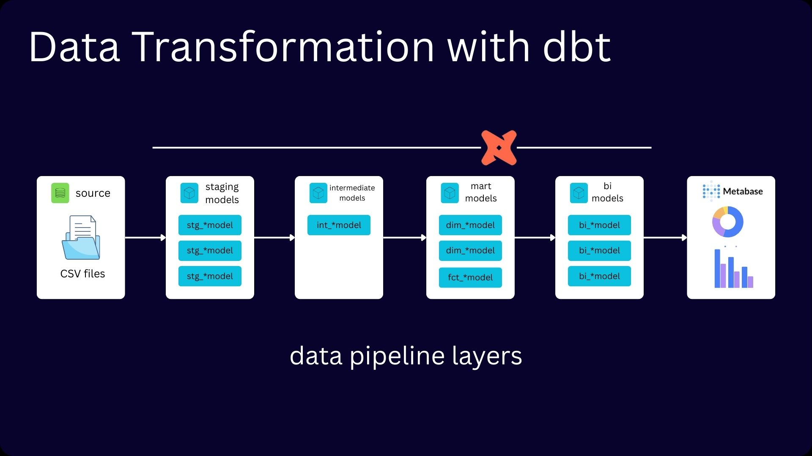

# Data Tranformation with DBT

## Project Overview

This project demonstrates the end-to-end design of a production-grade Analytics Engineering pipeline using dbt and DuckDB, from raw ingestion to BI-ready data models.

_Figure 1: Data Pipeline Architecture_

## What I Implemented

1.  **Structured Transformation Pipeline**
    *   Designed a layered architecture (**Staging** -> **Intermediate** -> **marts**) following modern Analytics Engineering best practices.
    *   **Standardized** and **cleaned** raw datasets into canonical, contract-driven models.
    *   Clearly defined **model grain** and responsibility at each layer

_Figure 2: Pipeline Lineage_

1.  **Cost-Efficient Incremental Processing**
    *   Implemented an **incemental fact model** using **dbt's** `incremental` **materialization**.
    *   Reduced unnecessary recomputation by loading only new data based on time-based logic
    *   Ensured idempotency through deterministic surrogate keys
2.  **Historical Tracking with SCD Type 2**
    *   Implemented **Slowly Changing Dimensions** using **dbt snapshots**
    *   Preserved historical attribute changes with valid-from / valid-to logic
    *   Exposed a current-state dimension view for clean analytics joins
3.  **Data Quality Enforecement**
    *   Applied generic and **custom dbt tests** (uniquesness, non-null, relationships, temporal integrity).
    *   Enforced logical constraints (e.g. pickup \< dropoff)
    *   Maintained model contraints through **automated validation**
4.  **Canonical Data Modeling for BI Consumption**
    *   Built **fact and dimension tables** aligned to a **star schema**
    *   Introduced **deterministic surrogate keys** for stable joins
    *   Created **BI-ready serving models** optimized for dashboard querying

_Figure 3: BI Consuming data models_

1.  **Comprehensive Documentation and Lineage**
    *   Documented models, columns and tests within dbt.
    *   Establihed clear model ownership and data contracts.
    *   Generated lineage graph

_Figure 4: dbt Project Documentation_

## Key Lessons

*   Data Modeling Design and Decisions
    *   Kimball design, star/snowflake modeling
*   dbt snapshot, macros, tests, incremental model
*   Data Transformation
    *   Standardization
    *   Quality Enforcement
*   Data Artifacts
    *   Physical sources, logical sources, Analytical entities
*   Modeling pipeline with dbt
    *   project tructure
    *   SQL
    *   modularity

This purpose of this project was to learn and demonstrate how to build a **robust** and **cost efficient data transformation pipeline** using dbt, building a pipeline architecture based on **industry standard** methods, applying tests, incremental models, slowly changing dimensions and creating a comprehensive documentation.